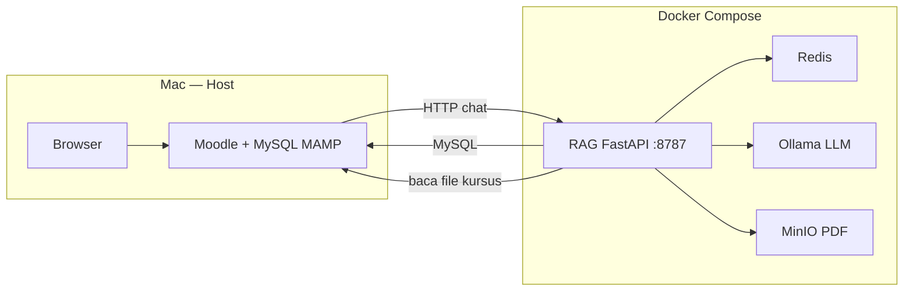

# Tutorial Docker — Moodle Chatbot (Bahasa Indonesia)

Panduan singkat untuk menjalankan **backend chatbot** (FastAPI + Ollama + Redis + MinIO) di dalam Docker. **Moodle tetap di MAMP** di Mac kamu; hanya layanan AI/RAG yang di-container.

---

## Apa itu Docker (secara sederhana)?

- **Image** = resep / template aplikasi (misalnya Python + kode RAG).
- **Container** = instance yang jalan dari image (seperti “app terbuka”).
- **Docker Compose** = satu file YAML yang menjalankan **beberapa container sekaligus** (RAG, Redis, Ollama, MinIO) dengan jaringan dan volume yang sudah diset.

Kamu tidak perlu install Python/Redis/Ollama manual di Mac untuk stack ini — cukup Docker Desktop.

---

## Arsitektur



| Di host (MAMP) | Di Docker |
|----------------|-----------|
| Moodle PHP, MySQL | FastAPI RAG |
| `dataroot` file Moodle | Ollama (model AI) |
| | Redis (riwayat chat + cache) |
| | MinIO (simpan PDF pengetahuan) |

---

## Prasyarat

1. Install **Docker Desktop** untuk Mac: https://www.docker.com/products/docker-desktop/
2. Buka Docker Desktop sampai status **Running**.
3. MAMP sudah jalan: MySQL + situs Moodle (`moodle500`).
4. Tahu path **dataroot** Moodle (biasanya `/Applications/MAMP/data/moodle500`).
5. Password MySQL sama seperti di `config.php` Moodle.

---

## Langkah demi langkah

### 1. Masuk ke folder root proyek Moodle

```bash
cd /Applications/MAMP/htdocs/moodle500
```

Semua perintah `docker compose` di bawah ini dijalankan dari folder ini.

### 2. Buat file konfigurasi Docker

```bash
cp local/chatbot/docker/.env.example local/chatbot/docker/.env
```

Edit `local/chatbot/docker/.env`:

| Variabel | Isi contoh | Keterangan |
|----------|------------|------------|
| `MYSQL_PASSWORD` | password MAMP kamu | Pakai tanda kutip jika ada `*` atau `#` |
| `MYSQL_DATABASE` | `moodle500` | Sama dengan DB Moodle |
| `MOODLE_DATAROOT_HOST` | `/Applications/MAMP/data/moodle500` | Path **di Mac**, bukan di dalam container |
| `OLLAMA_CHAT_MODEL` | model yang kamu pakai | Harus sudah di-pull nanti |

**Penting:** File ini **bukan** `rag_service/.env`.  
- Tanpa Docker → pakai `local/chatbot/rag_service/.env`  
- Dengan Docker → pakai `local/chatbot/docker/.env`

### 3. Build dan jalankan semua service

Cara mudah:

```bash
./local/chatbot/docker/start.sh up -d --build
```

Atau manual:

```bash
docker compose -f local/chatbot/docker/docker-compose.yml \
  --env-file local/chatbot/docker/.env up -d --build
```

Tunggu beberapa menit pertama kali (download image + build Python).

### 4. Download model Ollama (wajib sekali)

Model AI besar; jalankan setelah container `ollama` sehat:

```bash
./local/chatbot/docker/start.sh --profile init-models run --rm ollama-init
```

Atau satu per satu:

```bash
docker exec -it moodle-chatbot-ollama ollama pull bge-m3
docker exec -it moodle-chatbot-ollama ollama pull qwen3_q4km:latest
```

### 5. Cek apakah RAG hidup

```bash
curl http://127.0.0.1:8787/health
```

Kalau dapat JSON sukses, backend siap.

### 6. Set Moodle plugin

1. **Site administration** → **Plugins** → **Local plugins** → **Chatbot**
2. **FastAPI URL** → `http://127.0.0.1:8787`
3. Jika `CHATBOT_SECRET` diisi di `docker/.env`, samakan di Moodle (**Shared secret**)

### 7. (Opsional) Index PDF di MinIO

- Console MinIO: http://127.0.0.1:9001 (login dari `.env`, default `minioadmin` / `minioadmin`)
- Upload PDF ke bucket `smart-knowledge`
- Lalu:

```bash
docker exec -it moodle-chatbot-rag python scripts/build_sinarmas_index.py
```

---

## Penjelasan file di folder `local/chatbot/docker/`

| File | Fungsi |
|------|--------|
| **docker-compose.yml** | Daftar service: `rag`, `redis`, `minio`, `ollama`, plus init bucket/model. Port, volume, dependency antar container. |
| **Dockerfile** | Cara build image **rag**: Python 3.11, install `requirements.txt`, copy kode RAG + `local/ocr`. |
| **entrypoint.sh** | Sebelum `uvicorn` jalan, tunggu Redis, Ollama, dan MinIO siap; buat folder ChromaDB. |
| **.dockerignore** | File yang **tidak** ikut build (`.venv`, `chroma_db`, `.env`) supaya image kecil & aman. |
| **.env.example** | Template variabel lingkungan; copy jadi `.env`. |
| **scripts/ollama-init.sh** | Pull model embedding + chat (+ vision opsional) ke volume Ollama. |
| **start.sh** | Shortcut: cek `.env` ada, lalu panggil `docker compose` dari root repo. |

### Cuplikan penting `docker-compose.yml`

- **`rag`** mem-build dari `Dockerfile`, port `8787`, mount volume `rag_chroma` (vektor ChromaDB tetap ada walau container di-restart).
- **`MOODLE_DATAROOT_HOST`** di-mount read-only ke `/moodle/dataroot` di dalam RAG agar bisa baca file kursus Moodle.
- **`MYSQL_HOST=host.docker.internal`** supaya container bisa akses MySQL di Mac (bukan socket MAMP).
- **`OLLAMA_BASE_URL=http://ollama:11434`** — nama service Docker, bukan `127.0.0.1` di dalam jaringan container.

### Cuplikan `Dockerfile`

1. Base image `python:3.11-slim`
2. Install library sistem untuk PDF (MuPDF)
3. `pip install -r requirements.txt`
4. Copy kode aplikasi
5. Jalankan `entrypoint.sh` → `uvicorn main:app`

---

## Perintah sehari-hari

```bash
# Lihat log RAG
./local/chatbot/docker/start.sh logs -f rag

# Status container
./local/chatbot/docker/start.sh ps

# Stop (data volume tetap)
./local/chatbot/docker/start.sh down

# Stop + hapus semua data (Chroma, model Ollama, MinIO) — hati-hati
./local/chatbot/docker/start.sh down -v
```

---

## Troubleshooting

| Gejala | Kemungkinan penyebab | Solusi |
|--------|----------------------|--------|
| `bind: address already in use` port 6379 | Redis sudah jalan di Mac (dev lokal) | Set `REDIS_HOST_PORT=6380` di `docker/.env`, atau stop Redis lokal: `brew services stop redis` |
| `moodle-chatbot-ollama is unhealthy` | Healthcheck pakai `curl` padahal image Ollama tidak punya curl | Update `docker-compose.yml` (sudah pakai `ollama list`), lalu `start.sh up -d` lagi |
| Port 11434 bentrok | Ollama app Mac + Docker sama-sama pakai 11434 | Stop Ollama Mac, atau set `OLLAMA_HOST_PORT=11435` di `docker/.env` |
| `Ollama HTTP error (500)` di UI | `num_ctx` terlalu besar → proses Ollama killed (OOM) | Turunkan `OLLAMA_CHAT_NUM_CTX=6144` di `docker/.env`, samakan dengan `rag_service/.env`, lalu `restart rag` |
| MySQL Access denied di log RAG | `MYSQL_PASSWORD` di `docker/.env` masih placeholder | Salin password MAMP yang benar dari `rag_service/.env`, lalu `up -d` |
| RAG restart terus | Ollama/Redis belum siap | `docker compose ... ps` dan `logs rag` |
| Error koneksi MySQL | Password/salah DB | Cek `MYSQL_*` di `docker/.env`; pastikan MAMP MySQL listen TCP (port 3306) |
| Chat kosong / model error | Model belum di-pull | Jalankan langkah 4 (ollama-init) |
| Moodle tidak bisa chat | URL plugin salah | Pastikan `http://127.0.0.1:8787` |
| File kursus tidak kebaca | Path dataroot salah | `MOODLE_DATAROOT_HOST` harus path asli di Mac |

---

## Port yang terbuka di Mac

| Port | Service |
|------|---------|
| 8787 | RAG API (yang dipakai Moodle) |
| 11434 | Ollama |
| 6379 | Redis |
| 9000 | MinIO API |
| 9001 | MinIO Web UI |

---

Versi Inggris / referensi teknis: [README.md](./README.md)
